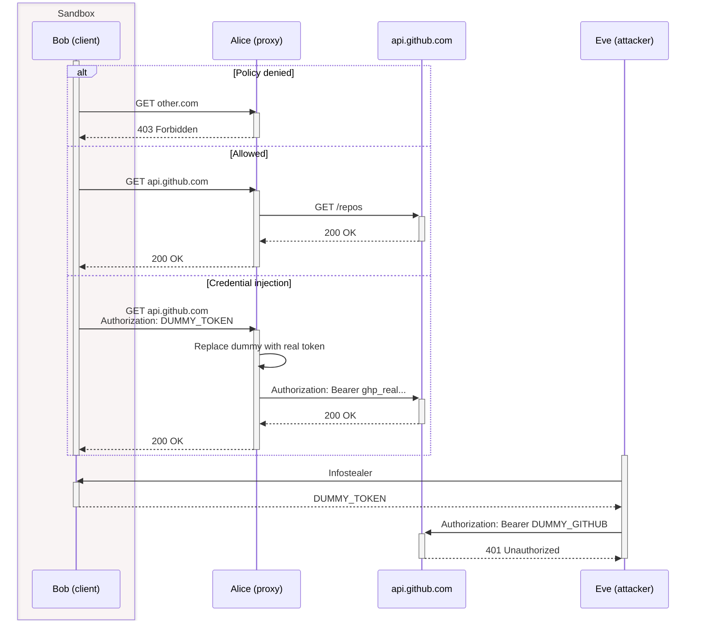

# alice

A sanitizing HTTPS proxy that lets processes use secrets they can't see.

> *Go ask Alice / I think she'll know* — Jefferson Airplane

## The Problem

You have a process that needs to call authenticated APIs - but you don't trust it with the credentials. Maybe it's a build script, a CI job, an LLM agent, or a sandboxed tool. Today your options are: give it the real token and hope for the best, or don't give it network access at all.

## How Alice Works

Alice sits between the client ("Bob") and the internet. Bob sends requests with **dummy tokens** - placeholders like `Bearer DUMMY_GITHUB`. Alice intercepts the request, swaps the dummy for the **real secret** (loaded from an env var, file, or SOPS-encrypted store), and forwards it upstream.
Bob never sees the real credential. It exists only in Alice's memory.

On top of credential injection, Alice enforces an **access control policy**: a default-deny allowlist of hosts and paths, evaluated with glob patterns. Bob can only reach what you explicitly permit - and credentials are scoped to specific hosts, so even a compromised client can't exfiltrate secrets to an attacker-controlled server.

## Features

- **TLS inspection** - MITM with per-host certificate generation
   - HTTP/1.1 and HTTP/2 via ALPN negotiation, H2-to-H1.1 translation
   - Short-lived CA generated at startup (default 6 hours)
- **Access control** - Default-deny allowlist with glob patterns, first-match-wins
   - Host and path matching (e.g., `*.openai.com` + `/v1/chat/completions`)
   - CIDR deny rules to block resolved IPs (DNS rebinding protection)
   - Proxy authentication (HTTP Basic on CONNECT)
- **Credential injection** - Replace dummy tokens with real secrets at the proxy layer
   - Sources: environment variables, files, or [SOPS](https://github.com/getsops/sops)-encrypted stores
   - Scoped by host pattern - credentials only injected for matching hosts
- **Observability** - Structured JSON logging and distributed tracing
   - OpenTelemetry (OTLP) span export with per-request semantic conventions
   - LLM usage parsing (Anthropic Messages API): token counts, model, tool calls

## Quickstart

```sh
cargo build
cargo run -- -c examples/policies/httpbin.toml
```
Configure your client to use the proxy and trust Alice's CA:
```sh
export HTTPS_PROXY=http://127.0.0.1:3128
curl --cacert /tmp/alice-ca.pem https://httpbin.org/get
```
The CA certificate is generated fresh on each startup (default validity: 6 hours).

## Configuration

Alice is configured with a TOML file. Here's a full example:
```toml
[proxy]
listen = "127.0.0.1:3128"
username = "bob"                # Optional proxy auth
password_env = "ALICE_PASS"

[ca]
cert_path = "/tmp/alice-ca.pem"
validity_hours = 6
host_cert_validity_hours = 2

[dns]
cache_ttl_secs = 300
cache_max_entries = 1000

# Static hostname overrides
[dns.hosts]
"internal.service" = ["10.0.0.5"]
"blocked.example" = ["0.0.0.0"]

# First match wins, default deny
[[rules]]
action = "allow"
host = "api.github.com"

[[rules]]
action = "allow"
host = "*.openai.com"
path = "/v1/chat/completions"

# Block cloud metadata (DNS rebinding protection)
[[rules]]
action = "deny"
cidr = "169.254.169.254/32"

# Credential injection
[[credentials]]
name = "github"
host = "api.github.com"
header = "Authorization"
match = "Bearer DUMMY_GITHUB"    # Only replace when header equals this
format = "Bearer {value}"
env = "GITHUB_TOKEN"             # Load from env var
# Or: file = "/path/to/secret"   # Load from file
```

### Using SOPS for encrypted secrets

```sh
# Encrypt your secrets
sops -e secrets.env > secrets.enc.env

# Run Alice with decrypted env vars - works with age, GPG, AWS KMS, YubiKey
sops exec-env secrets.enc.env -- alice -c config.toml
```

## Security Model

See [SECURITY.md](SECURITY.md) for the full threat model, trust boundaries, and credential storage analysis.
The short version: Alice is designed for environments where Bob is untrusted or semi-trusted. Alice sees all plaintext traffic. Network-level enforcement (firewall rules, network namespaces, containers) is required to prevent Bob from bypassing the proxy.
